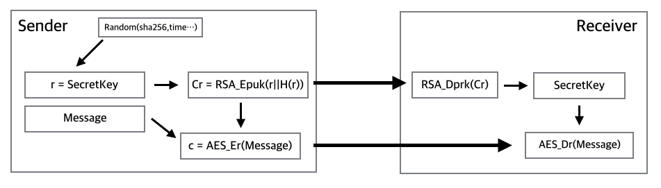

# hybridCrypto

This module will helps your encryption.

recommend default https setting also.

module life cycle like this.

##Installation

    $npm install hybridCrypto
    
##Usage
#### generate keyPair for RSA
like this.

    ssh-keygen -t rsa
    

only support pkcs1

#### Import Lib
    var hybridCrypto = require('hybridCrypto');

#### Encyrpt(Sender)
    //for RSA Encrypt
    var publicKeyPath = 'ur publci key path';
    var plainText = "=== Just test Message ====";
    var senderData = hybridCrypto.EncryptMessage(plainText,publicKeyPath)
    console.log(senderData) 
    //{enCryptSecKey:'blah..',enCryptSecKeyHash:'blah..',message:'blah..'   }

* this code will generate auto aesSecretKey.
* if u want aesSecrekey,then Using "getSecretKey()"
    
#### Decrypt(Reciver)
    var payLoad;// Received Data Chunk
    //for RSA Encrypt
    var privateKeyPath = 'ur Private key path';
    var receiverData = hybridCrypto.DecryptMessage(payLaod,privateKeyPath);
    console.log('receiver decrypted Data =>',receiverData);
    //receiver decrypted Data ==> === Just test Message ====

####optional.

#### getSecreKey();
    var secretKey = hybridCrypto.getSecretKey();
    console.log('secretKey ==>',secretKey);

* get a aesSecretKey

####hasKey();

    //for aesKey
    var cipher = hybridCrypto.hasKey('aesSecretKey');
    var data = cipher.EncryptMessage('message','./keyspub');

##### for Sessions or keyChange ruleSet.
#####if
* do not want change aesSecretKey. every messaging.
* already have aesSecretKey.
* already alive session.
* flow ur ruleSet.

####paramENCRYPT_SEC_KEY(val);
##### Change ReturnData Json Keys
Defualt Return Json type:

    { enCryptSecKey: 'O1cl+Eh1h2TXjiC1Atb3VrbqA66IPpcwV2GAd+Bnprg7gClvynwZ2v08xn5Z9S9zNOO7BZDOFz/g2mt5LQdAO8q1WxdrnI6BBG4ywY08ujtDgATLA8uKFtKBIXKfjM/jlxfMwW1zsv1sczohaXhR8mvGsIhhoE+Cv1Jjr8L5+Iw=',
      enCryptSecKeyHash: 'Pixm+2VnIKFNahP6m9oPOOVWKLHzVmmFUkbeIIjyNLdMRle0nZImRjZ9i4r038zBCbT3ecee5j7a4T03uE7cckURnA2WhpN3r3TICDmyOojGxFWq8hfdFN4kO1FDGw376fwEJu0xjn8nvrU8Suz+46GMJPXWWyNtfIyNaJxslq8=',
      message: 'dHBUdB99k3rNPwbqwA7EEDhUK+zNRs2wyvD11mrOywoOEi7/QcWv7deaLg==' }
  
you can change 'enCryptSecKey,enCryptSecKeyHash,message'.

like this.

set:

    hybridCrypto.paramENCRYPT_SEC_KEY('key');
    hybridCrypto.paramENCRYPT_SEC_KEY_HASH('hash'); 
    hybridCrypto.paramENCRYPT_MESSAGE('message'); 
    hybridCrypto.EncryptMessage(plainText,publicKeyPath)
    
    //and
    
    hybridCrypto.paramDECRYPT_SEC_KEY('key');
    hybridCrypto.paramDECRYPT_SEC_KEY_HASH('hash'); 
    hybridCrypto.paramDECRYPT_MESSAGE('message'); 
     hybridCrypto.DecryptMessage(payLaod,privateKeyPath);

* @@@ check!@@@
* this code **must** upper line than EncryptMessage() func;
* when change this EncryptParams, **must** change to DecryptParams.
       
    
result:

     {key: 'hH9n+v3hFm4GIQ0/knIDi3/gyxBvcavvxqJUm7bCGTvV9V4DBV2O1w7jjY1j5XOY4YNU4xgXVIUTqK1r4ozaQmlfgGIVndnxqES2Ls8NGJJiTS76tUgtQnvigkrgYGH0ayyfdFVhFTdzcWozoFISPKLrFIxrGuXZJ9b+PilEZrk=',
      hash: 'caD/J35jaYT6hBkXabZtKLgnP2cn3p9Bsrx+XbbrKiHe7gB+abkj9IbZFNpXhyTSuFDe3unbun5VtN6EZN83djFQphCnPy6QM+FK8G7PcnJDJbq9MK5TnCuZTPipRdrQZEXSCMvHcaRuRVdQkHG535/zahISI95k84GvrbzQRtU=',
      message: 'dBJsQZQVP6wKgbjHZZUS+lPZGaAnyYev0zvCnLfVV8Q+Epv1x7+OfPIl1w==' }

##License

Copyright (c) 2015 Yenos <cpg0504@gmail.com>

Permission is hereby granted, free of charge, to any person obtaining a copy of
this software and associated documentation files (the "Software"), to deal in
the Software without restriction, including without limitation the rights to
use, copy, modify, merge, publish, distribute, sublicense, and/or sell copies of
the Software, and to permit persons to whom the Software is furnished to do so,
subject to the following conditions:

The above copyright notice and this permission notice shall be included in all
copies or substantial portions of the Software.

THE SOFTWARE IS PROVIDED "AS IS", WITHOUT WARRANTY OF ANY KIND, EXPRESS OR
IMPLIED, INCLUDING BUT NOT LIMITED TO THE WARRANTIES OF MERCHANTABILITY, FITNESS
FOR A PARTICULAR PURPOSE AND NONINFRINGEMENT. IN NO EVENT SHALL THE AUTHORS OR
COPYRIGHT HOLDERS BE LIABLE FOR ANY CLAIM, DAMAGES OR OTHER LIABILITY, WHETHER
IN AN ACTION OF CONTRACT, TORT OR OTHERWISE, ARISING FROM, OUT OF OR IN
CONNECTION WITH THE SOFTWARE OR THE USE OR OTHER DEALINGS IN THE SOFTWARE.
